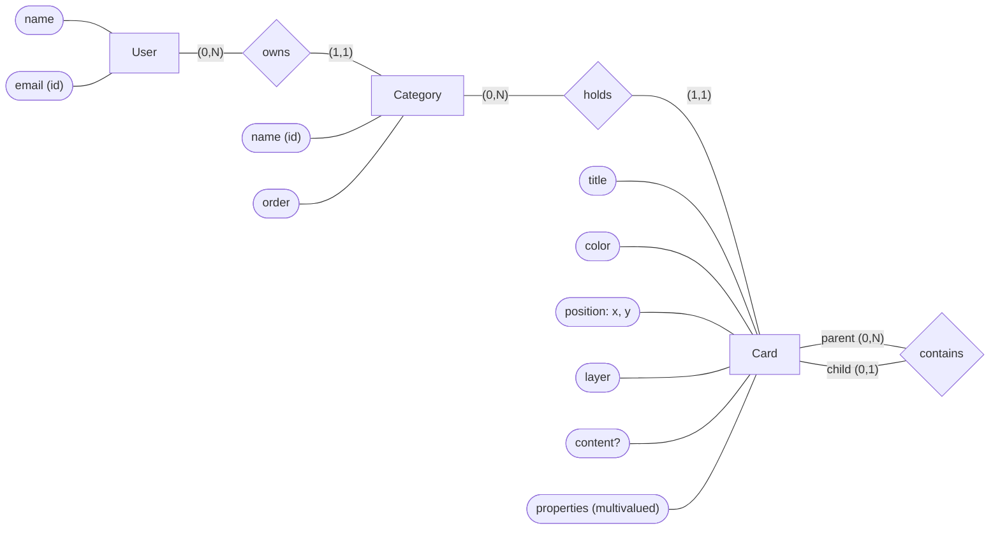

# 02 — Conceptual model

Second step of the design process. Derived from the [miniworld](01-miniworld.md), it describes **the world**, not the database:
there are no tables, columns or types here — those are decided in the logical model.

## Entities and attributes

| Entity | Attributes | Identifier |
|---|---|---|
| **User** | name, email | email |
| **Category** | name, order | name + owning user (name unique per user) |
| **Card** | title, color, position (x, y) *composite*, layer, content *optional*, properties *multivalued* | no natural one — artificial in the logical model |

All entities also record when they were created and last updated.

- **Card types were dropped.** An earlier version specialized Card into Task (with a date) and Note. Once
  properties became a flexible, growing catalog, the task's only attribute turned into a property like any
  other, and the specialization lost its reason to exist. Every card now has the same shape.
- **Properties** is a multivalued attribute: a set of (property, value) pairs taken from the system's catalog.
- **Board** is not an entity: it has no attributes of its own; it is how the direct children of a category or card are displayed.
- **Content** is a simple attribute: the database stores and reads it whole, even though it has internal structure (Tiptap blocks).
- **Color, position and layer** are presentation attributes; the others are domain attributes.
- **Content vs. properties:** material you read (text, tables, images) is content; information you filter
  or query by (due date, done) is a property.

## Relationships and cardinalities

`(min, max)` notation: the minimum tells whether participation is optional (0) or mandatory (1); the maximum, whether it is at most one (1) or many (N).

| Relationship | Reading | Type |
|---|---|---|
| User **owns** Category | A user owns (0,N) categories. A category belongs to (1,1) user. | 1:N |
| Category **holds** Card | A category holds (0,N) cards, at any depth. A card belongs to (1,1) category. | 1:N |
| Card **contains** Card (roles: parent, child) | A parent card contains (0,N) children. A child card is inside (0,1) parent; with no parent, it sits on the category's board. | 1:N, self-relationship |

## ER diagram

Peter Chen notation: rectangles are entities, diamonds are relationships, ellipses are attributes
(identifiers are underlined in theory; marked with `(id)` here).

## Constraints the diagram cannot express

Must be enforced in the physical model or in the API:

1. **Same category as the parent:** a child card belongs to the same category as its parent. This is a deliberate redundancy — a child's category could be derived by walking up to the root — kept to avoid an exclusive-or relationship and to make queries direct.
2. **No cycles:** a card cannot be the parent of itself or of one of its ancestors (the parent–child relationship forms a forest of rooted trees).
3. **Layer is relative to the board:** layer only compares cards with the same parent (or with no parent, in the same category).
4. **Category name unique per user.** Whether the comparison ignores letter case and surrounding spaces is decided in the physical model.
5. **Cascading deletes:** deleting a category deletes all of its cards; deleting a card deletes its whole subtree.
