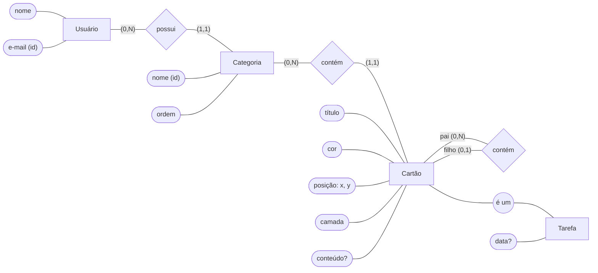

# 02 — Modelo conceitual

Segunda etapa da modelagem. Deriva do [minimundo](01-minimundo.md) e descreve **o mundo**, não o banco:
não há tabelas, colunas nem tipos aqui — isso é decidido no modelo lógico.

## Entidades e atributos

| Entidade | Atributos | Identificador |
|---|---|---|
| **Usuário** | nome, e-mail | e-mail |
| **Categoria** | nome, ordem | nome + usuário dono (nome único por usuário) |
| **Cartão** | título, cor, posição (x, y) *composto*, camada, conteúdo *opcional* | nenhum natural — será artificial no modelo lógico |
| **Tarefa** ⊂ Cartão | data *opcional* | herdado de Cartão |

- **Nota** não é entidade: é um cartão sem especialização (não tem atributos próprios).
- **Quadro** não é entidade: não tem atributos próprios; é a forma de exibir os filhos diretos de uma categoria ou de um cartão.
- **Conteúdo** é atributo simples: o banco o guarda e lê inteiro, mesmo tendo estrutura interna (blocos do Tiptap).
- **Cor, posição e camada** são atributos de apresentação; os demais são de domínio.

## Relacionamentos e cardinalidades

Notação `(mín, máx)`: o mínimo indica se a participação é opcional (0) ou obrigatória (1); o máximo, se é no máximo uma (1) ou várias (N).

| Relacionamento | Leitura | Tipo |
|---|---|---|
| Usuário **possui** Categoria | Um usuário possui (0,N) categorias. Uma categoria pertence a (1,1) usuário. | 1:N |
| Categoria **contém** Cartão | Uma categoria contém (0,N) cartões, em qualquer nível. Um cartão pertence a (1,1) categoria. | 1:N |
| Cartão **contém** Cartão (papéis: pai, filho) | Um cartão pai contém (0,N) filhos. Um cartão filho está dentro de (0,1) pai; sem pai, fica no quadro da categoria. | 1:N, autorrelacionamento |

## Especialização

Cartão ⊃ Tarefa — **disjunta** (um cartão tem no máximo um tipo) e **parcial** (pode existir cartão sem tipo: a nota).

## DER

Notação de Peter Chen: retângulos são entidades, losangos são relacionamentos, elipses são atributos
(identificadores sublinhados na teoria; aqui marcados com `(id)`).

## Restrições que o diagrama não expressa

Precisam ser garantidas no modelo físico ou na API:

1. **Mesma categoria do pai:** um cartão filho pertence à mesma categoria do seu pai.
2. **Sem ciclos:** um cartão não pode ser pai de si mesmo nem de um ancestral seu (a relação pai–filho forma uma floresta de árvores).
3. **Camada relativa ao quadro:** a camada só compara cartões com o mesmo pai (ou sem pai, na mesma categoria).
4. **Nome de categoria único por usuário.** A definir no modelo físico se a comparação ignora maiúsculas/minúsculas e espaços nas pontas.
5. **Exclusão em cascata:** apagar uma categoria apaga todos os seus cartões; apagar um cartão apaga toda a sua subárvore.
